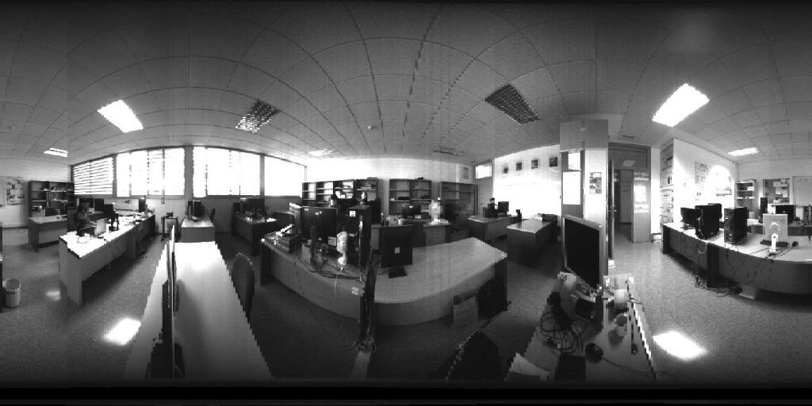
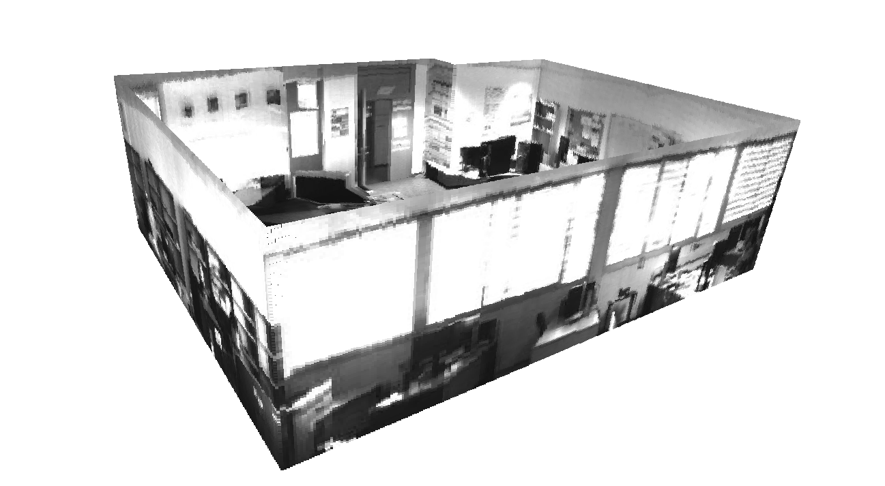

# Hello world !

## I am Bruno Berenguel-Baeta, Ph. D student in Universidad de Zaragoza, Spain.

### **About my persona**

I started my Engineering degree in 2012, in the [University of Zaragoza](http://www.unizar.es). Then, in 2017, the 2-year Masters on Engineering followed. In my second year, I participated in the Erasmus+ program and went to the [RWTH Aachen University](https://www.rwth-aachen.de) (Germany) were I started to learn computer vision and deep learning. The Erasmus was followed by an internship at Universidad de Zaragoza, in the [Department of Computer Science and Systems Enginnering](https://diis.unizar.es). 

In December 2019, I presented my Master's Thesis on omnidirectional images under the supervision of my advisors ([Jesús Bermudez-Cameo](https://webdiis.unizar.es/~bermudez/) and [Josechu Guerrero](https://webdiis.unizar.es/~jguerrer/)), which was the results of the internship in the department. 

### **Ph.D (so far)** 

My Ph.D started in January 2020 in the same department and with the same advisors with which I did my Master's thesis (Why should I change something that works?). At that moment, my life as Ph.D student started, and here I am some years later. Though, the starting time was not the best 🦠😷🦠😷🦠, it allowed my to focus on publishing with less distractions (also called life). 

My research interest is on ***Computer Vision*** and ***Deep learning***, and more specifically, *scene understanding from omnidirectional images*. I am also interested on geometrical and photometric approaches inside the computer vision field. I do have some experience on geometrical solutions (with great help of my advisors), but I have mostly focused on deep learning solutions in these last years. 

Here I present a recollection of the publications where I participated and the available code of some of them.

- 2023:
    - Semantic segmentation and depth estimation:
        - Conference article, *ICRA'23*: [FreDSNet: Joint Monocular Depth and Semantic Segmentation with Fast Fourier Convolutions](https://arxiv.org/abs/2210.01595)
        - Code: [FreDSNet](https://github.com/Sbrunoberenguel/FreDSNet)

- 2022:
    - Scaled layout estimation from non-central panoramas:
        - Journal article, *Pattern Recognition* Elsevier: [Atlanta Scaled layouts from non-central panoramas](https://www.sciencedirect.com/science/article/pii/S0031320322002217)
        - Code: [Scaled layouts](https://github.com/Sbrunoberenguel/scaledLayout)
        - Dataset article, *Data in brief* Elsevier: [Non-central panorama indoor dataset](https://www.sciencedirect.com/science/article/pii/S2352340922005728)
        - Code (from Jesus Bermudez-Cameo repository): [Non Central Indoor dataset](https://github.com/jesusbermudezcameo/NonCentralIndoorDataset)

- 2021:
    - Layout estimation from non-central panoramas:
        - Workshop article, *OmniCV'21*: [Scaled 360 Layouts: Revisiting Non-Central Panoramas
](https://openaccess.thecvf.com/content/CVPR2021W/OmniCV/html/Berenguel-Baeta_Scaled_360_Layouts_Revisiting_Non-Central_Panoramas_CVPRW_2021_paper.html)
            - Video presentation: [Video](https://www.youtube.com/watch?v=pjHhiujSusM)

- 2020:
    - Omnidirectional image generator from Unreal Engine 4 virtual environments:
        - Journal article, *Sensors* MDPI: [OmniSCV: An omnidirectional synthetic image generator for computer vision](https://www.mdpi.com/1424-8220/20/7/2066)
        - Conference article, *Jornadas I3A* 2020: [Omnidirectional Image Data-Set for Computer Vision Applications](https://despapiro.unizar.es/ojs/index.php/jji3a/article/view/4869)
            - Conference poster: [Poster.pdf](misc/Poster.pdf)
        - Code: [OmniSCV](https://github.com/Sbrunoberenguel/OmniSCV)
        - Dataset: [Omnidirectional images dataset]()
    - Floor detection and extension for autonomous guidance:
        - Conference article, *ICARCV'20*: [Floor extraction and door detenction for visually impaired guidance](https://ieeexplore.ieee.org/abstract/document/9305464)

### **A bit more**

If you have come so far as to be reading this, that means that you already know about my GitHub profile .

You can also find my research work on Google Scholar
 
and Orcid 

If you want to contact me directly, my email address is: berenguel@unizar.es

I do hope this page helps someone to get to my work (and of course, that my work is useful for many many people). And also, to add some "color", here is one of the results of my research with non-central panoramas. Enjoy it hehe.

<align="left">

<align="right">

